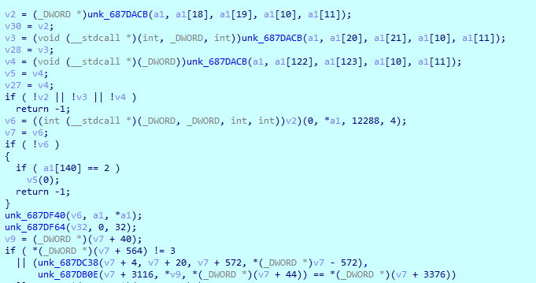
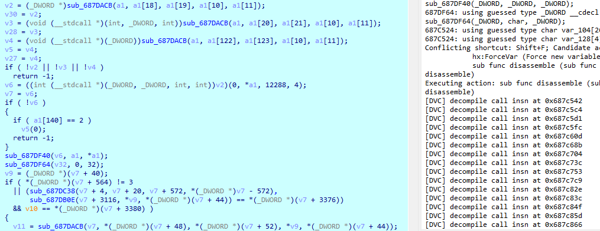
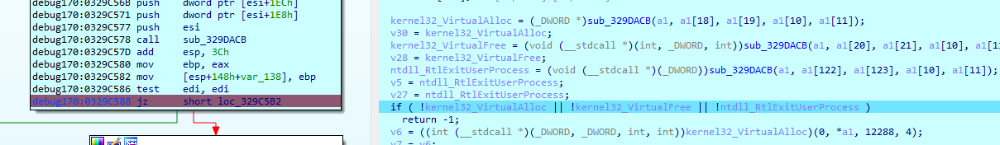

# Dynamic Variables Check
 
Dynamic identification of variable values when debug running.   
When you debug shellcode, there are many function to be created, and might be some API Waiting to be identified.  
DVA can help you easily finish it.  
  
调试的时候动态检查局部变量的值。  
当你调试shellcode的时候，这里会有许多待创建的函数，或许还会有一些等待识别的系统API。  
DVA可以帮助你轻松的完成这些任务。  

## Create function for call insn
Hotkey: Shift-F  
Create func before:  
  

Put cursors on the target function, then press Shift-F:  
  

## Check local variables
DVA can identify all dll handle and system api(you can add the key word to the global variable api_key_word).  

There has two action range, current ip between block start and whole function.  
* current ip between block start(recommend): Shift-B  
* whole function: Shift-A  
  
Ip stop on target block, then press Shift-B:  

## Warning
Due to the select position may be just has been modified SP value or spd has been broken. So in rare cases, local variables identify may result in errors.You can press 'Ctrl+z' withdraw variables rename.  

## Support
The plugin suport 7.4 between 9.x.  
If you have any question, please open an issue on GitHub.  
The plugin now has been integrated into the SUKI_IDA project(https://github.com/miunasu/SUKI_IDA).  
